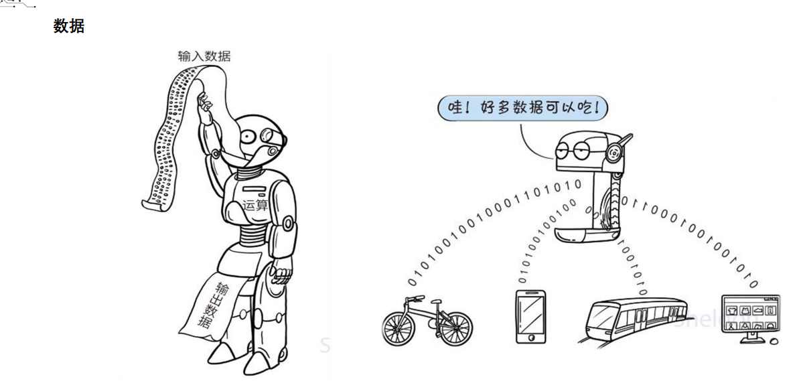

# 
第一周学习笔记

## 1. 什么是人工智能?

    对于人工智能的定义，学界一直有不同的表述，一种被广泛接受的说法是：人工智能是通过机器来模拟人类认知能力的技术。 人工智能涉及很广，涵盖了感知、学习、推理与决策 等方面的能力。从实际应用的角度说，人工智能最核心的
    能力就是根据给定的输入做出判断或预测。

人工智能发展历程：

## 2 人工智能的核心要素

人工智能的三大核心要素：数据、算法、算力

### 2.1 数据

### 2.2 算法

当你交给计算机一个任务的时候，不但要告诉它做什么，还要告诉它怎么做。关于“怎么做”的一系列指令就叫做算法

### 2.3 算力

算力的突破

## 3. 机器学习

    当代的人工智能普遍通过学习来获得进行预测和判断的能力----机器学习（machine learning）
    机器学习是计算机利用已有的数据(经验)，得出了某种模型(迟到的规律)，并利用此模型预测未来(是否迟到)的一种方法

## 4. 神经网络

## 5. 深度学习

1) 传统的神经网络发展到了多隐藏层的情况,具有多个隐藏层的神经网络被称为深度神经网络.
2) 基于深度神经网络的机器学习研究称之为深度学习。

   

## 6. 计算机视觉

1) 对图像中的客观对象构建明确而有意义的描述
2) 从一个或多个数字图像中计算三维世界的特性
3) 基于感知图像做出对客观对象和场景有用的决策
4) 就是让计算机拥有人能所见、人能所识、人能所思的能力，就可以称计算机拥有视觉，即计算机视觉。

### 6.1 计算机视觉的应用

1) 图像分类
   

2) 目标检测
   

3) 目标跟踪
   

4) 语义分割
   

5) 实例分割
   
