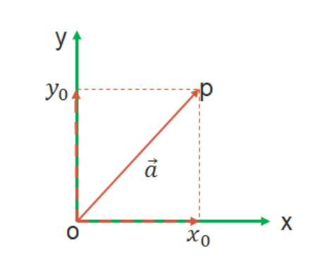

# 
第二周学习笔记

## 1. 向量

$\vec{a}$ = (x,y)

## 2. 矩阵
    简单来说,矩阵就是充满了数字的表格。

A = $
\begin{bmatrix}
1&2\\
3&4\\
\end{bmatrix}
$

B = $
\begin{bmatrix}
5&1&2\\
3&0&-5\\
\end{bmatrix}
$

### 2.1 矩阵加减法

1)  两个矩阵相加或相减，需要满足两个矩阵的列数和行数一致。
1)  加法交换律：A + B = B + A
A = $
\begin{bmatrix}
3&-1\\
2&0\\
\end{bmatrix}
$
B = $
\begin{bmatrix}
-7&2\\
3&5\\
\end{bmatrix}
$